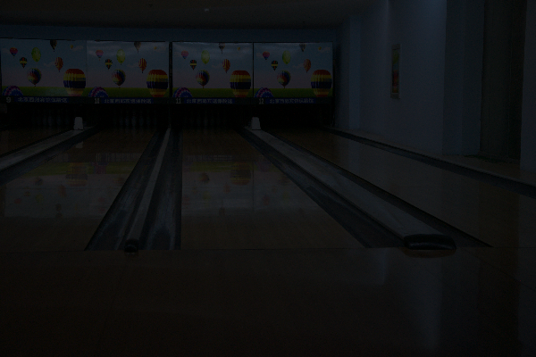
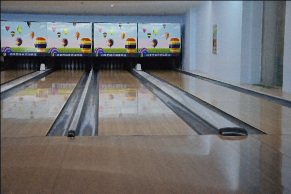
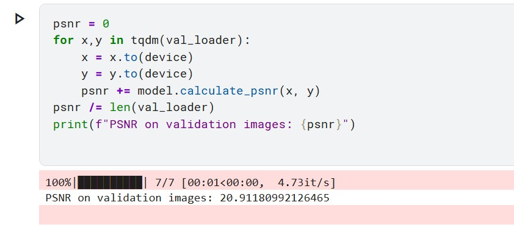
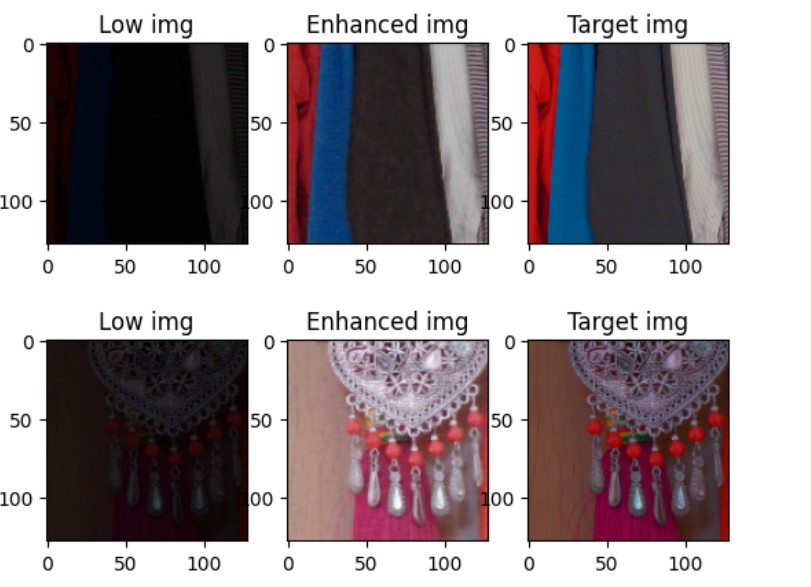

# Low-Light Image Restoration via Retinex-Transformer Architecture

## Visual Results

Here is a side-by-side comparison of the low-light input processed through our pipeline versus the ground truth:

| Input Image (Low-Light) | Enhanced Output (Bright-Light) |
| :---: | :---: |
|  |  |


Visit: [](https://dark-image-enhancer.streamlit.app/)

[](https://pytorch.org/)
[](https://opencv.org/)
[](https://streamlit.io/)

Low light image enhancer is a state-of-the-art computer vision pipeline engineered to restore high-quality imagery from extremely low-light environments. This framework implements a hybrid approach, seamlessly uniting robust **OpenCV (cv2)** image preprocessing workflows with a customized **RetinexFormer** neural network architecture.

---

## Model Architecture Specifications

The framework incorporates physical priors based on Retinex Theory paired with deep learning transformer architectures for pixel-level feature restoration. The complete system design is detailed below:

### 1. Illumination Estimator
* **Functionality:** Estimates the light illumination map directly from the input frame matrix ($X$).
* **Layers:** Employs **Depthwise Separable Convolutions** (3x3 Depthwise Conv $\rightarrow$ 1x1 Pointwise Conv $\rightarrow$ ReLU) to minimize hardware parameters and guarantee low-latency inference speeds.

### 2. Illumination-Guided Multi-Head Self-Attention (IG-MSA)
* **Core Logic:** Unlike conventional self-attention mechanisms, this module dynamically injects the estimated Illumination Map as a guidance matrix for calculating attention weights.
* **Mathematical Interaction:**
  $$Q_{guided} = Q \times (1 + \text{Illumination Map})$$
  This formulation explicitly forces the transformer layers to assign higher attention weights to severely degraded and dark pixel regions.

### 3. Symmetric U-Net Denoiser (IGAB Blocks)
* **Bottleneck Split:** The network follows an encoder-decoder design pattern where each hierarchical layer is integrated with an **IGAB (Illumination-Guided Attention Block)**.
* **Skip Connections:** Implements symmetric skip connections to preserve high-frequency spatial features and localized pixel context across deep layers.

```text

```

### 4. Loss Formulations
The network is optimized using a L1 loss function.

# Performance Benchmarks & Evaluation

The model has been rigorously evaluated using PSNR (peak-signal-to-noise-ratio):
```
Evaluation Dataset Split                  Achieved Performance (PSNR)
LOL (Low-Light) Dataset                   19+ dB
Custom Dataset                            19+ dB
```

### PSNR Score on LOL validation data


### Sample outputs for validation data



## Future Roadmap
* [ ] Integrate it with an android app.
