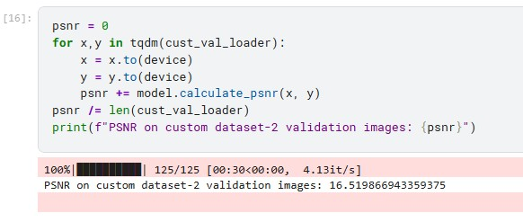
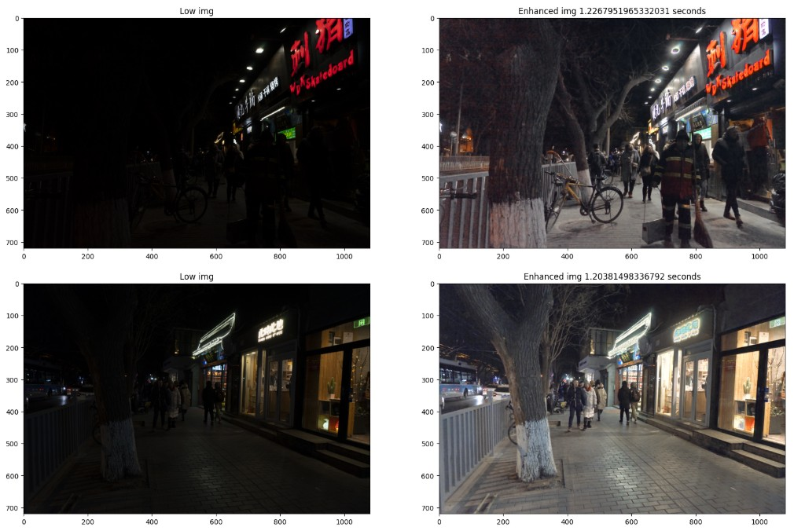
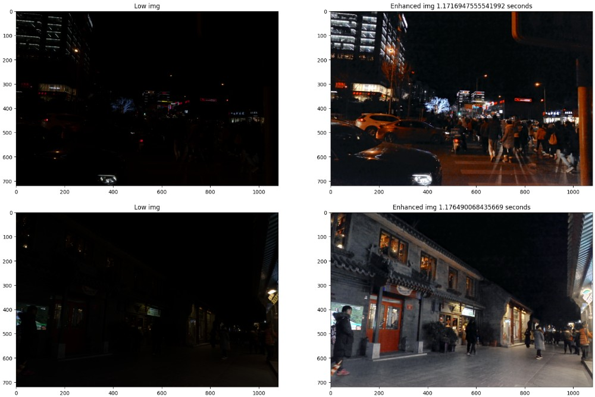

# Low-Light Image Restoration via Retinex-Transformer Architecture

Low Light Image Enhancer is a state-of-the-art computer vision pipeline engineered to restore high-quality imagery from extremely low-light environments. This framework implements a hybrid approach, seamlessly uniting physical image decomposition via **Retinex Theory** with deep learning feature restoration using a customized **RetinexFormer** architecture.

---

## 📸 Visual Results

Here is a side-by-side comparison of the low-light input processed through our pipeline versus the ground truth target:

| Input Image (Low-Light) | Enhanced Output (Bright-Light) |
| :---: | :---: |
|  |  |

🚀 **Try the Live Web App:** 

---

## 💡 How It Works (Core Concept)

RetinexFormer models an image $I$ based on classical **Retinex Theory**, which decouples an image into pixel-wise components of **Illumination** ($L$, environmental light) and **Reflectance** ($R$, true surface properties):

$$I = L \times R$$

Instead of restoring low-light images end-to-end like a black box, RetinexFormer explicitly estimates the illumination feature map first. This spatial lighting context guides the deep transformer blocks to selectively clean noise and sharpen details in dark regions.

---

## 🛠️ Model Architecture Specifications

The model pipeline consists of two primary modules: `IlluminationEstimator` and a multi-scale `Denoiser` powered by **Illumination-Guided Attention Blocks (IGAB)**.

### 1. Illumination Estimator
* **Input Concatenation:** Takes the original RGB image ($3$ channels) and appends its channel-wise mean ($1$ channel) to create a $4$-channel feature input.
* **Architecture:** Uses a $1\times1$ Conv layer, followed by a $5\times5$ Depthwise Convolution (groups = input channels) to capture spatial light context, and a final $1\times1$ Conv to output both an illumination feature map (`illu_fea`) and a light adjustment map (`illu_map`).

### 2. Illumination-Guided Multi-Head Self-Attention (IG-MSA)
* **Value-Guided Modulation:** Unlike standard transformers, IG-MSA dynamically injects spatial lighting prior into the **Value ($V$)** matrix before dot-product attention calculation:
  $$V_{\text{guided}} = V \odot \text{illu\_fea}$$
* **Channel-wise Attention:** Attention matrices are computed along feature channels rather than spatial dimensions. This reduces computational complexity from quadratic $O(N^2)$ to linear $O(N)$, ensuring GPU-friendly memory consumption during high-resolution inference.
* **Positional Encoding:** Employs depthwise $3 \times 3$ convolutions with GELU activation to embed spatial layout details into token features.

### 3. Multi-Scale U-Net Denoiser (IGAB)
* **Symmetric Encoder-Decoder:** Features an encoder-decoder architecture with $2\times$ downsampling and upsampling operations integrated across dynamic depths.
* **Skip Connections:** Preserves localized multi-scale pixel structures and high-frequency edge cues across skip pathways.
* **Feed-Forward Network (FFN):** Uses gated depthwise $3\times3$ convolutions to refine spatial details after self-attention integration.

### 4. Training Strategy & Optimization
* **Loss Function:** Optimized using pixel-wise **L1 Loss** (or custom criterion) between model prediction clamped to range $[0, 1]$ and target clear image $Y$.
* **Gradient Stabilization:** Enforces hard gradient norm clipping capped at `max_norm=5.0` to prevent exploding gradients during attention optimization.

---

## 📊 Performance Benchmarks & Evaluation

The network has been evaluated across standard low-light benchmarks using **PSNR (Peak Signal-to-Noise Ratio)**:

| Evaluation Dataset Split | Achieved Performance (PSNR) |
| :--- | :---: |
| **LOL (Low-Light) Dataset** | **20+ dB** |
| **Custom Merged Dataset** | **16+ dB** |

### Benchmark Visuals

#### 1. PSNR Score on LOL Validation Data

#### 2. Sample Outputs for LOL Validation Data

#### 3. PSNR Score on Custom Validation Data

#### 4. Sample Outputs for DarkFace Dataset

---

## 📦 Datasets Used
1. **LOL-v1 Dataset:** Popular benchmark dataset for low-light image enhancement ([Kaggle Dataset Link](https://www.kaggle.com/datasets/shaileshhkumarr/lol-dataset)).
2. **Custom Paired Dataset:** Multi-source merged dataset combining LOL, RELLISUR, and LOLI-Street ([Kaggle Dataset Link](https://www.kaggle.com/datasets/shaileshhkumarr/llie-paired-image-datasets)).
3. **DarkFace Dataset:** Unpaired real-world night face dataset used for qualitative visual validation ([Kaggle Dataset Link](https://www.kaggle.com/datasets/shaileshhkumarr/darkface-dataset)).

---

## 🛣️ Future Roadmap
- [ ] Mobile Deployment: Quantize model weights for real-time processing on Android via ONNX/TFLite.
- [ ] Real-time Video Stream Restoration module.
